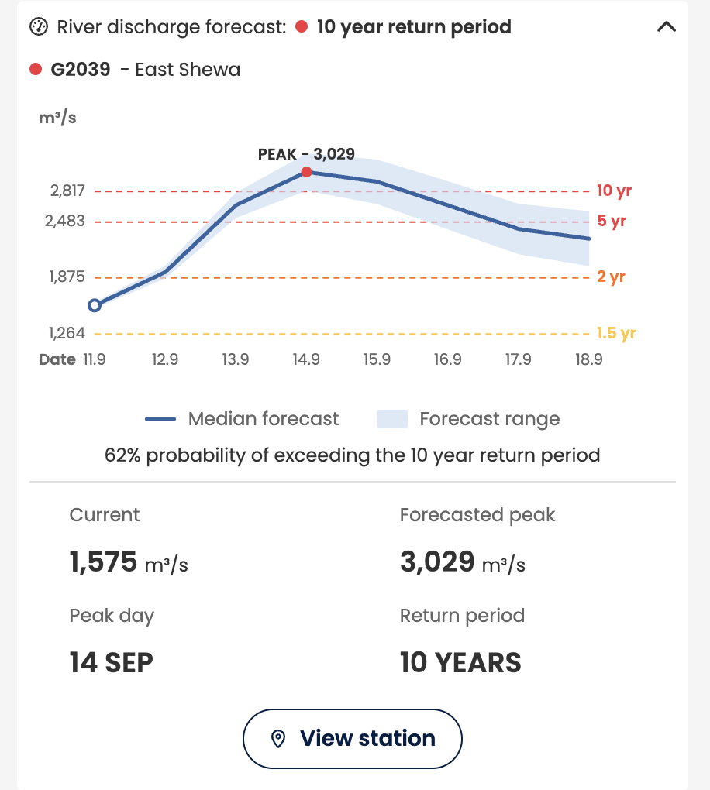

The river discharge forecast is the raw forecast behind a flood event. It is where you check the platform's reasoning rather than take its word for it.

### Opening the graph

The **river discharge forecast** section sits inside the expanded event card, below the exposed areas table, and is **collapsed by default**. The label on the closed section, for example **5 year return period**, is the severity of the forecast peak.

1. Open the event, so the card expands.
2. Scroll down inside the event card, past the exposed areas table.
3. Click the **river discharge forecast** row, or the chevron at its right, to expand the graph.
4. Click it again to collapse it.

The **data sources** section directly below it works the same way.

---

### What the graph shows

- **Horizontal axis:** calendar dates across the 7 day forecast window, starting today
- **Vertical axis:** river discharge in cubic meters per second (m3/s), the volume of water passing the station each second

| Element | Meaning |
| :--- | :--- |
| **Forecast line** | The expected discharge for each day of the window, at this station |
| **Forecast range** | The spread across the 51 model runs around that line. It widens with lead time, because forecasts further out are less certain |
| **Return period lines** | Horizontal lines, one per return period configured for this location, for example 1, 5 and 20 year. These are the thresholds |
| **Peak** | The highest forecast discharge in the window, and the date it is expected |

---

### The return period lines are the thresholds

This is the most useful part of the graph and the easiest to skim past. Each horizontal line is the discharge value that counts as a flood of that rarity **at this station**, derived from that station's own history.

Read the graph by asking which lines the forecast crosses, and when.

- **A forecast that stays below every line** is normal seasonal water.
- **A forecast that crosses the 1 year line** is water the river sees most years. Not usually a reason to act.
- **A forecast that crosses the 5 year line** is a flood of a kind seen roughly once every five years.
- **The highest line the forecast crosses** is the severity of the event, and it is what the return period label on the section refers to.

Because the lines come from each station's own record, the same 5 year line sits at a different discharge value at every station. Two events at the same return period are comparable in rarity, not in volume of water.

!!! Note "Where the line and the alert level meet"
    Crossing a return period line is only half of what sets the alert level. The other half is how many of the 51 model runs cross it. See below.

---

### Probability: how many runs cross the line

GloFAS does not produce one forecast. It produces **51**, each from slightly different starting conditions. The forecast range on the graph is that spread.

The probability for a return period is the share of those 51 runs whose discharge crosses that return period's line.

- If 13 of 51 runs cross the 5 year line, the probability of a 5 year flood is about 25 percent
- If 38 of 51 cross it, the probability is about 75 percent

Both are "a 5 year flood is possible". They are very different decisions.

| Reading | What it means for you |
| :--- | :--- |
| High severity, high probability | The clearest case. Check the lead time, then your protocol |
| High severity, low probability | Worth preparing to prepare. A rare flood is on the table but most model runs do not produce it |
| Low severity, high probability | Something will almost certainly happen, and it is within what the river normally does |
| Narrow forecast range | The model runs agree. Timing and size are relatively firm |
| Wide forecast range | The model runs disagree. The peak could arrive earlier, later, or be much larger or smaller |

!!! Important "Probability, severity and lead time together make a trigger"
    Your Early Action Protocol activates on a specific return period, reached with at least a specific probability, at no less than a specific lead time. All three have to hold. This is why an event can show a high alert level without showing a trigger. See [From early warning to early action](../../introduction/early-warning-early-action.md).

---

### How to read it in practice

1. Find the **highest return period line** the forecast crosses, and on which day it crosses it.
2. Look at the **forecast range** at that crossing. Do most runs cross, or only the top few?
3. Find the **peak** and its date. That is when the river is expected to be highest.
4. Count the days between today and the crossing, and compare that with the lead time your actions need.

### One station per event

The graph shows one station: the GloFAS station the event is built around. An event is constructed from the discharge forecast at a single station, compared against that station's thresholds, which is why there is one graph rather than one per admin area.

The station is a point on the river, and it may sit some distance upstream or downstream of the areas shown as exposed. Switch on the station layer to see where it actually is before reading its forecast as local.

<!-- VERIFY: multiple stations per event, and showing all stations in a country including ones outside the event, were both asked for in the DE and ET sessions. Confirmed as out of scope for the pre-release. Revisit this section when that changes. -->

-8<- "docs/en/_snippets/contact-support.md"
