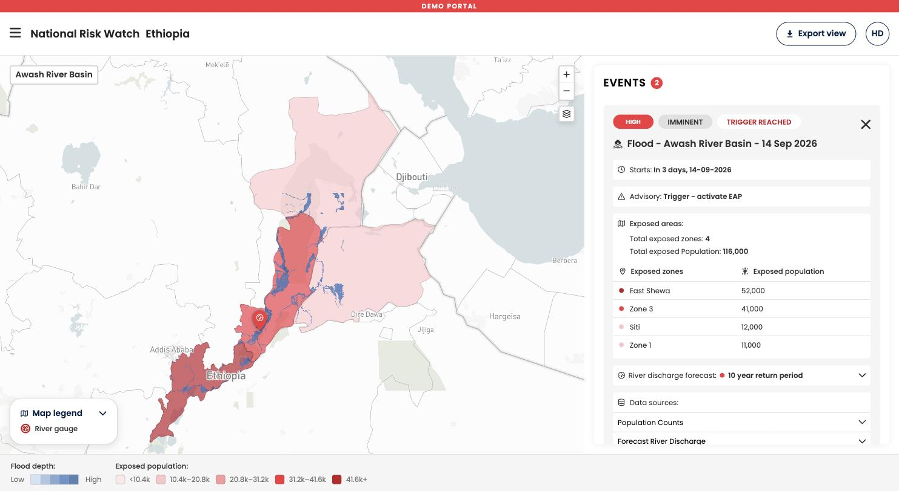

Floods are the only hazard in this pre-release. This page describes the map layers specific to flood events, what each one means, and where it comes from.

### The layers

| Layer | What you see | What it means | Where it comes from |
| :--- | :--- | :--- | :--- |
| **Exposed population** | Admin areas shaded from pale to dark red | The estimated number of people standing in water at least 10 cm deep, per admin area. Classes recalibrate per view, see [Understanding the legend](../../platform/legend.md). | Flood depth combined with population counts |
| **Flood depth** | Blue shading over the map, darker where deeper | How deep the water is expected to be at the peak of the event. The edge of the blue area is the area the flood is forecast to reach | A global flood hazard map, per return period |
| **River discharge station** | A point marker on the river | The GloFAS station whose forecast drives this event | GloFAS, see [Data sources](./data-sources.md) |

### Reading flood depth

The flood depth layer answers two questions at once. The **extent** of the blue area is where water is forecast to reach. The **shade** within it is how deep that water is expected to be. Both refer to the **peak of the event**, not to how the flood develops: the layer does not show water arriving or receding.

The layer is tied to a specific return period. A 5 year flood depth map covers a different area, with different depths, than a 20 year map for the same river. The return period that applies to the event is shown in the river discharge forecast section of the event card.

!!! Note "Ten centimeters is the cut off"
    Water shallower than 10 cm is not counted. The exposed population figure counts people inside the area where flood depth reaches at least 10 cm, so very shallow flooding does not inflate the numbers.

!!! Warning "Flood depth is modeled, not observed"
    The layer comes from a flood hazard model, not from satellite observation or a field report. Local features such as a new embankment, a blocked culvert, or recent construction are not in the model. Use it to narrow down where to look, then verify locally.

### Low and medium events have no flood depth layer

For events at low or medium alert level, **no flood depth layer is shown and no exposed population is calculated**. This is not a display problem. Flood depth is only produced for events that reach the trigger return period configured for your country, because that is the severity the available hazard maps cover.

For a low or medium event you still get the event itself, its alert level, its dates, the river discharge forecast graph with its return period lines, and the probability behind it. You do not get a map of where the water will be or a count of who is exposed.

!!! Question "Does flood depth or flood extent data exist for your country at lower severities?"
    Some National Societies and national agencies hold flood hazard maps we do not have. If you know of flood depth or flood extent data for your country, at any return period, please [contact us](mailto:support@nationalriskwatch.org). We will look at whether it can be added.

-8<- "docs/en/_snippets/contact-support.md"
