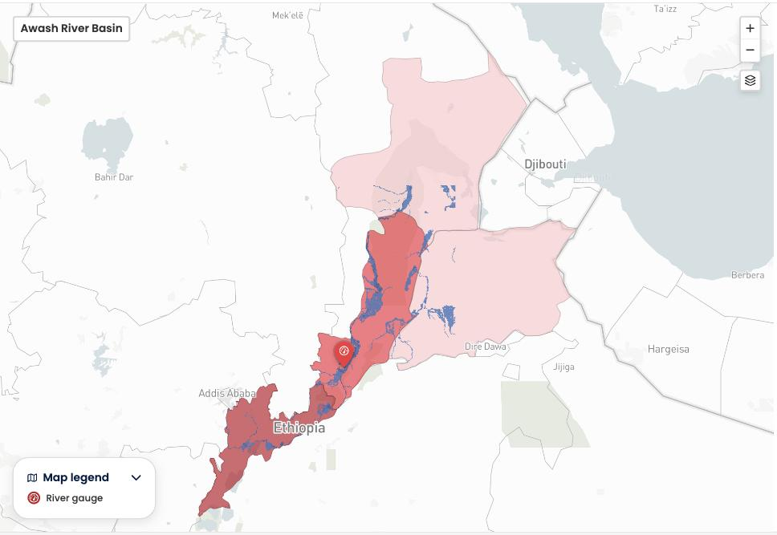

The core of National Risk Watch is an impact based forecasting map. It is built to show **what the weather will do**, not only what the weather will be.

### From weather to impact

A conventional forecast tells you that a river will reach a certain discharge, or that a certain amount of rain will fall. That is hard to act on, because it does not say who is at risk. Impact based forecasting adds two more ingredients.

| Ingredient | What it contributes |
| :--- | :--- |
| **Weather or hydrological forecast** | How severe the hazard is expected to be, and when. For floods this is a forecast of river discharge. |
| **Historical data** | How this forecast compares with what has happened before in the same place, expressed as a return period. This is what makes a number severe or ordinary. |
| **Population data** | How many people live in the areas the hazard is expected to reach. For floods this is WorldPop, a 100 m population grid. |

Combining the three produces the figure you work with in the platform: the **exposed population**, shown per admin area and shaded on the map.

### Exposed population and total population

This distinction matters and is easy to misread.

- **Exposed population** is the estimated number of people inside the area the hazard is forecast to reach. This is the number the platform shows and the number the map colors are based on.
- **Total population** is everyone living in the admin area, whether or not the hazard is forecast to reach them. The platform does not currently show this figure.

**Every population number in the platform is an exposed population.** For floods it is the count of people standing in water forecast to be at least 10 cm deep at the peak of the event, produced by laying the flood depth map over the population grid.

An admin area is shaded according to its exposed population, even when only part of that area is expected to be affected. A large district can therefore look severe simply because more people live in it.

!!! Note "Drill down before you plan"
    Coloring is applied to the whole admin area polygon, not only to the part expected to flood, so a coarse level tells you where to look rather than where to act. Drill to the lowest available admin level before planning. See [Map navigation](../platform/map-navigation.md).

### What this means for your decision

Because the figure combines three uncertain inputs, a forecast, a hazard model and a population grid, treat it as an order of magnitude rather than a count. It is strong enough to tell you where to concentrate attention and roughly how large a response might need to be. It is not a beneficiary list.

-8<- "docs/en/_snippets/contact-support.md"
