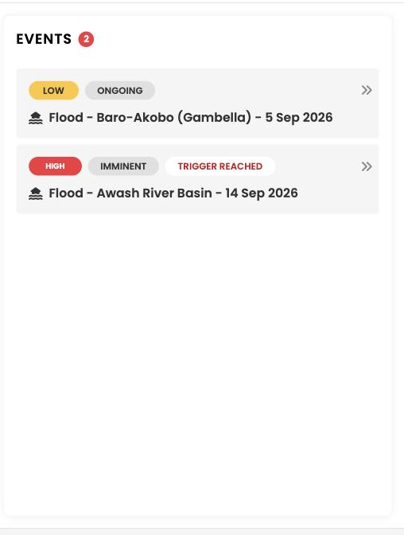

### The events panel

The events panel on the right lists every event currently active in your country. The number next to the **Events** heading is the count of active events.

Each collapsed card shows the minimum you need to triage:

- The **alert level** as a colored chip: low, medium or high warning
- The **status** as an outlined chip: imminent, ongoing or ended
- **Trigger reached**, in red, when your protocol's activation conditions are met. This is separate from the alert level, not a level above it
- The **hazard icon** and the event name, which combines hazard, location and date

Click a card to open the event. The card expands in place and the map follows.

### Inside an expanded event card

| Section | What it tells you |
| :--- | :--- |
| **Alert level, status, trigger** | How severe and likely the forecast is, where the event sits in time, and separately whether your protocol's activation conditions are met. See [From early warning to early action](../introduction/early-warning-early-action.md). |
| **Starts** | When the event is expected to begin. See [Event dates and statuses](../hazards/floods/dates-and-statuses.md). |
| **Advisory** | A short reminder of what your protocol expects at this alert level. |
| **Exposed areas table** | Every exposed admin area with its exposed population, and a colored dot matching the map. Totals are shown above the table. |
| **Forecast section** | For floods, the river discharge forecast and its return period. Collapsed by default, click to expand the graph. |
| **Data sources** | The datasets this event was built from. Collapsed by default, click to expand. |
| **Event created and last updated** | When the event first appeared and when the forecast behind it last refreshed. |

!!! Note "Two sections are collapsed until you open them"
    The **river discharge forecast** and the **data sources** sections sit at the bottom of the event card, below the exposed areas table, and are closed when the card opens. Scroll down inside the card and click the row, or the chevron at its right, to expand either one. Click again to close it. The forecast graph and the list of datasets behind the event are both in there, so it is worth opening them before you act on what the card says.

### Layers

The layers button, below the zoom controls at the top right of the map, opens the list of map layers you can switch on and off.

Which layers are available depends on the hazard and on the data loaded for your country. For floods the layers are described in [Flood layers explained](../hazards/floods/layers.md).

!!! Note "Reading several layers together"
    Exposed population and flood depth answer different questions, so they are often useful side by side. If a combination is hard to interpret, turn one off to isolate what you are looking at.

-8<- "docs/en/_snippets/contact-support.md"
