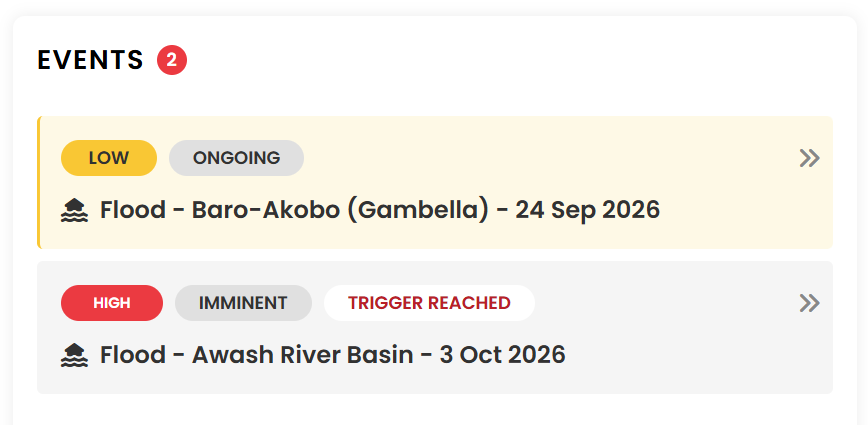

### The events panel

The events panel on the right lists every event currently active in your country. The number next to the **Events** heading is the count of active events.

The events listed in the events panel show the key facts at a glance:

- **How serious it is:** the alert level is indicated as low (yellow), medium (orange) or high (red)
- **Where it stands:** the status is indicated as imminent, ongoing or ended
- **Trigger reached:** this is indicated in red when the conditions to activate your early action plan are met. It is not a level above "high": an event can be medium and still reach the trigger
- **What, where and when:** the type of hazard is indicated as an icon, followed by the event name, location, and date when the event is expected to start, for example **Flood - Awash River Basin - 26 Sep 2026**

Click an event to see more details. The event opens in the list as the event card and the map zooms to the exposed area.

### Inside the event card

| Section | What it tells you |
| :--- | :--- |
| **Alert level, status, trigger** | How severe and likely the forecast is, where the event sits in time, and separately whether your protocol's activation conditions are met. See [From early warning to early action](../introduction/early-warning-early-action.md). |
| **Starts** | When the event is expected to begin. See [Event dates and statuses](../hazards/floods/dates-and-statuses.md). |
| **Advisory** | A short reminder of what your protocol expects at this alert level. |
| **Exposed areas table** | Every exposed admin area with its exposed population, and a colored dot matching the map. Totals are shown above the table. |
| **Forecast section** | For floods, the river discharge forecast and its return period. Closed by default, click to open the graph. |
| **Data sources** | The datasets this event was built from. Closed by default, click to open. |
| **Event created and last updated** | When the event first appeared and when the forecast behind it last refreshed. |

!!! Note "Two sections are closed until you open them"
    The **river discharge forecast** and the **data sources** sections sit at the bottom of the event card, below the exposed areas table, and are closed when the event card opens. Scroll down inside the event card and click the row, or the arrow (v) at its right, to open either one. Click again to close it. The forecast graph and the list of datasets behind the event are both in there, so it is worth opening them before you act on what the card says.

### Layers

The layers button, below the zoom controls at the top right of the map, opens the list of map layers you can switch on and off.

Which layers are available depends on the hazard and on the data loaded for your country. For floods the layers are described in [Flood layers explained](../hazards/floods/layers.md).

!!! Note "Reading several layers together"
    Exposed population and flood depth answer different questions, so they are often useful side by side. If a combination is hard to interpret, turn one off to isolate what you are looking at.

-8<- "docs/en/_snippets/contact-support.md"
