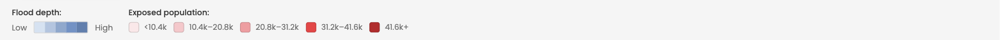

The legend sits in the strip directly below the map. It always describes what is currently on the map, so its contents change when you open an event.

### In the national overview

The legend explains the event markers.

- **Alert level:** low warning, medium warning and high warning
- **Trigger:** a separate marker color for events where your protocol's activation conditions are met. It sits in the alert level group in the legend, but it is not a fourth level. See [From early warning to early action](../introduction/early-warning-early-action.md)
- **Event type:** one icon per hazard, for example a wave for floods and a sun for drought

### In the event view

The legend switches to explain the shading.

- **Flood depth:** a blue gradient from shallow to deep, used by the flood depth layer
- **Exposed population:** five classes from minimal to critical, used to shade admin areas

### The exposed population classes recalibrate

This is the part most people miss. The five exposed population classes are **not fixed thresholds**. They are calculated from the range of values in the view you are currently looking at.

- At national level, the darkest class is the most exposed admin area in the country for that event
- After you drill into a district, the classes recalculate against the areas inside that district

The practical consequence: **the same shade of red means different numbers at different levels.** A dark area inside a district is the most exposed area in that district, not necessarily a nationally severe number. Always read the figure in the exposed areas table next to the color.

!!! Warning "Do not compare colors across views"
    Two areas that look equally dark in two different views can have very different exposed populations. Compare the numbers, not the shades.

### Alert level colors are fixed

Unlike the exposed population classes, alert level colors are fixed and always mean the same thing: yellow for low warning, orange for medium warning, and red for high warning. Triggered events are marked in dark red, which indicates that your protocol's activation conditions are met rather than a higher severity.

-8<- "docs/en/_snippets/contact-support.md"
