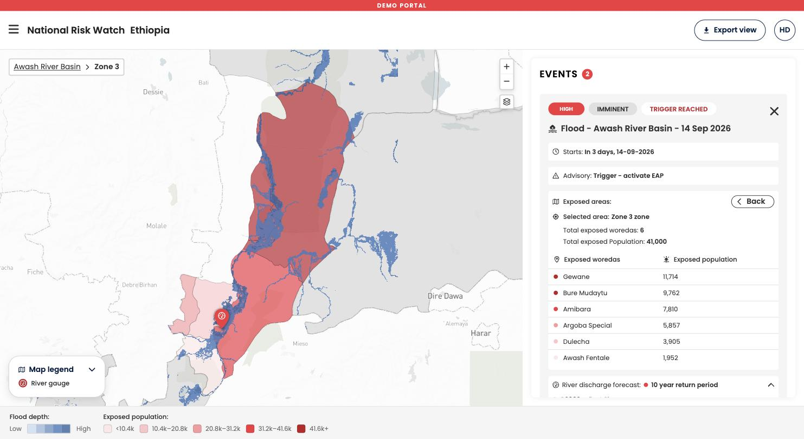

There are two ways to move around National Risk Watch: through the map, and through the event cards in the events panel. Both lead to the same place, so use whichever matches how you are thinking.

### Zooming and panning

- Use the **plus** and **minus** buttons at the top right of the map, or scroll to zoom
- Drag the map to pan
- The map is bounded to your country, so you cannot pan away from it

### Opening an event from the map

In the national overview each event is a colored marker, shaded by its alert level. Click the marker to open the event. The map zooms to the exposed area, the exposed admin areas are shaded, and the event card in the panel expands.

### Drilling down into admin areas

Once an event is open, the exposed admin areas are shaded on the map and listed in the event card.

1. Click an admin area on the map, or click its row in the exposed areas table, to open that area.
2. The map zooms to it and the next admin level down is shaded inside it.
3. Click again to select a single area at the lowest available level. The selected area is outlined and the others are dimmed.

!!! Note "How deep you can go depends on your country"
    The admin levels available follow the boundaries loaded for your country, for example region, district, and the level below it. The names shown come from the global administrative boundary dataset used by the platform, which may differ from the names your National Society uses internally.

### Breadcrumbs: getting back up

The breadcrumb at the top left of the map is the back navigation of the map. It shows where you are and lets you step back up.

- In the event view it shows the event location, which returns you to the national overview
- One level down it reads **location > district**, and clicking the location returns you to the whole event
- Two levels down it reads **location > district > area**, and each earlier step is clickable

!!! Note "The browser back button works too"
    Browser back steps you up one level, the same as clicking the previous breadcrumb. Browser forward returns you to where you were.

### Closing an event

Click the **x** at the top right of the expanded event card, or click the event location in the breadcrumb, to return to the national overview.

-8<- "docs/en/_snippets/contact-support.md"
