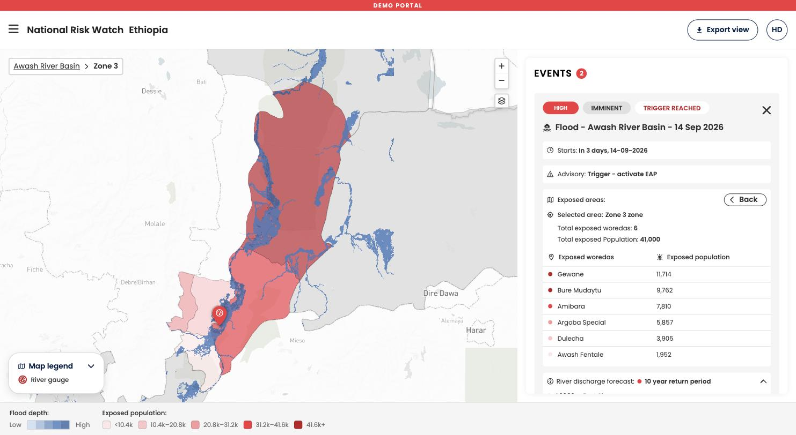

There are two ways to move around National Risk Watch: through the map, and through the events panel. The first displays the national overview from which you can navigate to the event and admin areas; the latter displays the event from which you can navigate to the admin areas or zoom out. When you close the event, the map shifts back to the national view.

### Zooming and panning

- Use the **plus** and **minus** buttons at the top right of the map, or scroll with your mouse, to zoom in and out
- Drag the map to change the visible frame in any direction
- You cannot zoom out beyond the national view

### Opening an event from the map

In the national overview each event is a colored marker, shaded by its alert level. Click the marker to open the event. The map zooms to the exposed admin areas, shaded in colors that reflect the flood depth and exposed population. The events panel expands to display the detailed information in the event card.

### Zooming in on admin areas

Once an event is open, the exposed admin areas are shaded on the map and listed in the event card.

1. Click an admin area on the map, or click its row in the exposed areas table, to open that area.
2. The map zooms to it and the next admin level down is shaded inside it.
3. Click again to select a single area at the lowest available level. The selected area is outlined and the others are dimmed.

!!! Note "How deep you can go depends on your country"
    The admin levels available follow the boundaries loaded for your country, for example region, district, and the level below it. The names shown come from the global administrative boundary dataset used by the platform, which may differ from the names your National Society uses internally.

### Finding your way back on the map

At the top left of the map you will see a short trail of place names, for example **Awash River Basin > Zone 3 > Amibara**. It shows which part of the country you are looking at, going from the largest area to the smallest.

- When you first open an event, the trail shows only the event area (for example, **Awash River Basin**). Click it to go back to the map of the whole country.
- When you zoom into a district, the district name is added to the trail (**Awash River Basin > Zone 3**). Click **Awash River Basin** to see the whole event area again.
- When you zoom in further, the smaller area is added too (**Awash River Basin > Zone 3 > Amibara**). Click **Awash River Basin** or **Zone 3** to go back to that level.

!!! Note "The browser back button works too"
    You can also use the back and forward arrows of your web browser (top left of your browser window, next to the address bar). **Back** (←) takes you one step back to a wider view. **Forward** (→) takes you back to where you were.

### Closing an event

Click the **x** at the top right of the expanded event card, or click the event location in the trail at the top left of the map, to return to the national overview.

-8<- "docs/en/_snippets/contact-support.md"
