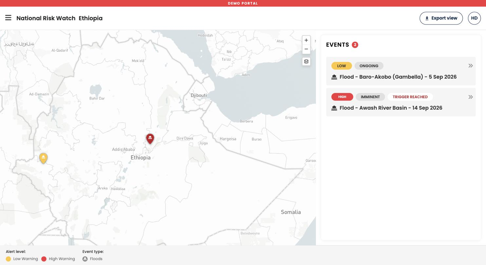

National Risk Watch opens on the national overview for your country. The screen has four parts that stay in the same place throughout.

| Part | Where | What it does |
| :--- | :--- | :--- |
| **Header** | Top of the screen | Shows the platform name and your country, and holds **Export view** on the right. |
| **Map** | Center and left | The national picture. Events appear as markers, and exposed areas are shaded once you open an event. |
| **Events panel** | Right side | The list of events currently active in your country, with a count. This is where you open an event and read its details. |
| **Legend** | Strip below the map | Explains the colors and symbols currently on the map. The legend changes as you move between views. |

### The two views

The platform has a national view and an event view. Everything else is a drill down inside the event view.

- **National overview.** All active events in your country as markers on the map, and one collapsed card per event in the events panel. Use this to see whether anything needs your attention.
- **Event view.** One event, with the exposed admin areas shaded on the map, an expanded card with alert level, status, advisory, dates, the exposed population table, the forecast graph, and the data sources behind it.

!!! Note "Designed for large screens too"
    The standalone platform is used both on a laptop and on a large monitor in an Emergency Operations Centre. The layout widens the map on larger screens. There is no separate display mode to switch on.

-8<- "docs/en/_snippets/contact-support.md"
