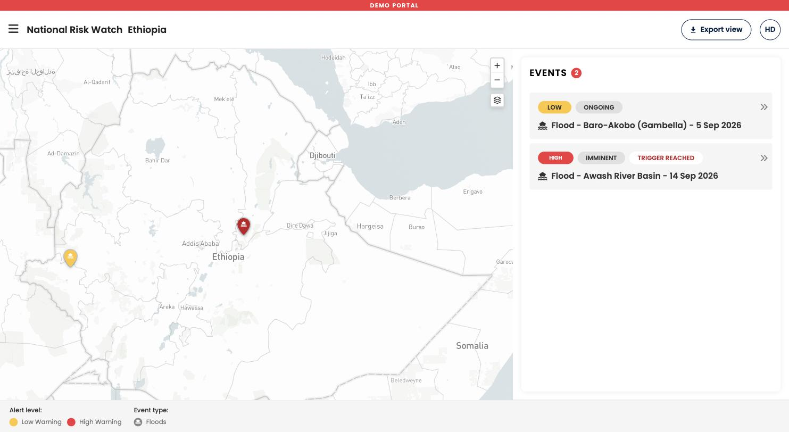
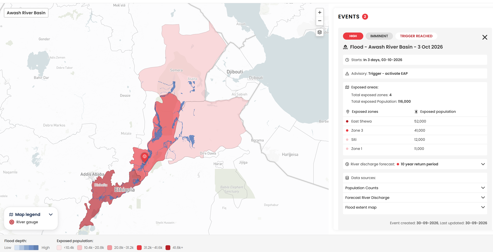

National Risk Watch opens on the national overview for your country. The screen displays four parts: the header, the map, the events panel and the legend.

### The two views

The platform has a national view and an event view. From the event, you can further zoom in at different admin levels.

- **National overview.** All active events in your country as markers on the map, and one line per event in the events panel. Use this to see whether anything needs your attention.
- **Event view.** One event, with the exposed admin areas shaded on the map, and the event card with alert level, status, advisory, dates, the exposed population table, the forecast graph, and the data sources behind it.

### National overview

| Part | Where | What it does |
| :--- | :--- | :--- |
| **Header** | Top of the screen | Shows the platform name and your country on the left, and the **Export view** button and **Account** drop down menu on the right. |
| **Map** | Left side | The country map. Events appear as markers, colored by alert level and with an icon for the hazard type. |
| **Events panel** | Right side | The list of events currently active in your country, with a count. This is where you open an event and read its details. |
| **Legend** | Strip below the map | Explains the colors and symbols currently on the map. The legend changes as you move between views. |

### Event view

When you open an event, the map zooms to the exposed admin areas and the event card opens in the events panel with all its details.

| Part | What changes in the event view |
| :--- | :--- |
| **Map** | The exposed admin areas are shaded in the color of the alert level, darker where more people are exposed. The flood depth layer shows in blue. |
| **Events panel** | Shows the event card of the selected event: alert level, status, trigger, advisory, dates and the exposed areas table. |
| **Legend** | Switches to flood depth and exposed population. |

!!! Note "Designed for large screens too"
    The standalone platform is used both on a laptop and on a large monitor in an Emergency Operations Centre. The layout widens the map on larger screens. There is no separate display mode to switch on.

-8<- "docs/en/_snippets/contact-support.md"
